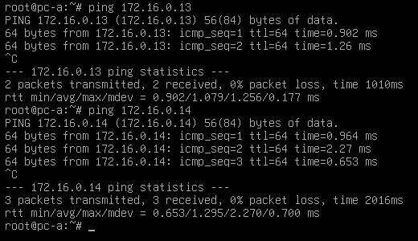

# Лабораторная работа №1

## Описание

В данной лабораторной работе нам было предложено реализовать копирование файлов с компьютера B на компьютер C с использованием терминала на компьютере А.

## Устройство сети

Ввиду отстутствия в наличии компьютеров с ОС Linux/Mac OS X, а также ради получения опыта развёртывания виртуальных компьютерных сетей, было принято решение использовать виртуализатор **VMware Workstation**.
Таким образом, было развернуто три идентичных виртуальных машины на основе дистрибутива **Debian 12**.

|Компьютер|Имя хоста|    IP-адрес  | Пользователь |
|---------|---------|--------------|--------------|
|    A    |  pc-a   |172.16.0.12/24|     root     |
|    B    |  pc-b   |172.16.0.13/24|     be1ov    |
|    C    |  pc-c   |172.16.0.14/24|  arch1varius |

Таким образом,  все компьютеры расположены в одной сети *172.16.0.0/24* и имеют прямой доступ друг к другу, что подтверждается результатом выполнения команды `ping`

## Предварительная настройка

Копирование файлов предлагается реализовать с использованием протокола **SSH**. Для его применения необходимо установить пакет **openssh-server**, путём выполнения следующих команд на компьютерах **pc-b** и **pc-c** (действия аналогичны, поэтому для экономии места, будут показаны действия только для компьютера **pc-b**).

1. Установка OpenSSH сервера

    `$ apt install openssh-server`

На этом, в принципе, настройка окончена (самая сложная конфигурация в нашей жизни, серьёзно XD).

## Основная часть

После окончания конфигурации можно перейти к реализации поставленных условий. Linux по-умолчанию предоставляет доступ к использованию команды `scp`, которая и обеспечивает возможность копирования файлов с локального компьютера на удаленный сервер, с удаленного сервера на локальный компьютер, а также с одного удаленного компьютера на другой удаленный компьютер.

В общем виде, конструктор команды `scp` выглядит следующим образом:

`$ scp [params] [source] [destination][:directory]`

Кроме того, нам пригодится команда `ssh`, которая предоставляет возможность управлять удаленным компьютером.

Конструктор команды `ssh` выглядит так:

`$ssh [params] destination [arguments]`

Более подробно синтаксис команды можно получить, используя утилиту `man`. В нашем же случае, нам необходимо воспользоваться параметром `-l <login>` для того, чтобы указать пользователя, от имени которого необходимо получить доступ к удаленному серверу.

### Ход работы

1. Получаем доступ к **pc-b** от имени пользователя *be1ov*

    `root@pc-a:~# ssh -l be1ov 172.16.0.13`

2. Вводим пароль

    `be1ov@172.16.0.13's password:`

    В случае успешной авторизации, отображается приветственное сообщение удаленного сервера

    

3. Выбираем сущесвующий или создаем новый подопытный файл.

    Так как у нас чистая система, создадим новый файл

    `be1ov@pc-b:~$ echo "Hello, senpai!" >> super_secret.txt`

4. Передаём файл на виртуальную машину **pc-c**

    `be1ov@pc-b:~$ scp ./super_secret.txt arch1varius@172.16.0.14:/home/arch1varius`

    

5. Готово! Давайте проверим, действительно ли файл передался.

    Выходим из текущего SSH сеанса

    `be1ov@pc-b:~$ exit`

    Получаем доступ к **pc-с** от имени пользователя *arch1varius*

    `root@pc-a:~# ssh -l arch1varius 172.16.0.14`

    ... и вводим пароль

    Перемещаемся в директорию, в которую был скопирован файл (в нашем случае - домашняя папка пользоателя *arch1varius*, мы уже в ней)

    Проверим содержимое директории командой `ls` и выведем содержимое файла на экран

    

    **Готово!**

## Вывод

В лабораторной работе был развернут **OpenSSH** сервер, реализующий протокол **SSH**, который используется для удаленного взаимодействия с сервером, в том числе для выполнения управляющих команд и копирования файлов.